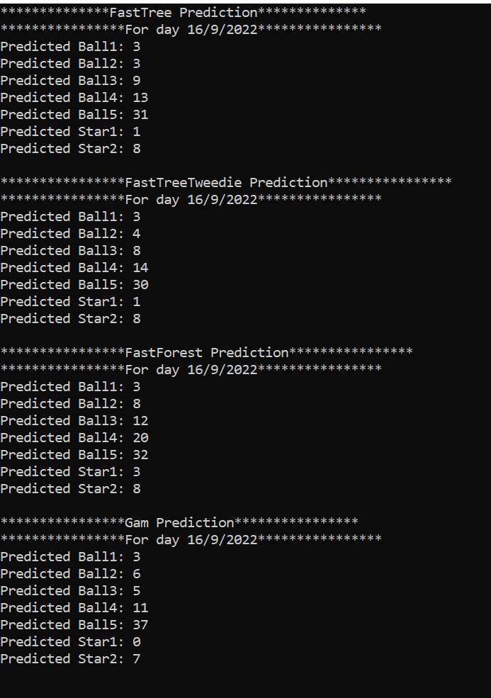

# Euromillions result predictor

## Requirements
* .net 6

## Features 
* download all sorts from https://nunofcguerreiro.com/api-euromillions-json?result=all
* train data
* calculate result for next prize date

## Trainers used
* [FastTree](https://docs.microsoft.com/en-us/dotnet/api/microsoft.ml.trainers.fasttree.fasttreeregressiontrainer?view=ml-dotnet)
* [FastForest](https://docs.microsoft.com/en-us/dotnet/api/microsoft.ml.trainers.fasttree.fastforestregressiontrainer?view=ml-dotnet)
* [FastTreeTweedie](https://docs.microsoft.com/en-us/dotnet/api/microsoft.ml.trainers.fasttree.fasttreetweedietrainer?view=ml-dotnet)
* [Gam](https://docs.microsoft.com/en-us/dotnet/api/microsoft.ml.trainers.fasttree.gamregressiontrainer?view=ml-dotnet)
* [LbfgsPoisson](https://docs.microsoft.com/en-us/dotnet/api/microsoft.ml.trainers.lbfgspoissonregressiontrainer?view=ml-dotnet)
* [OnlineGradientDescent](https://docs.microsoft.com/en-us/dotnet/api/microsoft.ml.trainers.onlinegradientdescenttrainer?view=ml-dotnet)
* [Sdca](https://docs.microsoft.com/en-us/dotnet/api/microsoft.ml.trainers.sdcaregressiontrainer?view=ml-dotnet)

## Output
